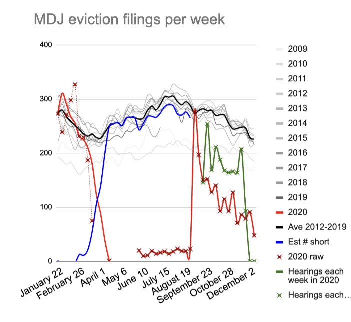
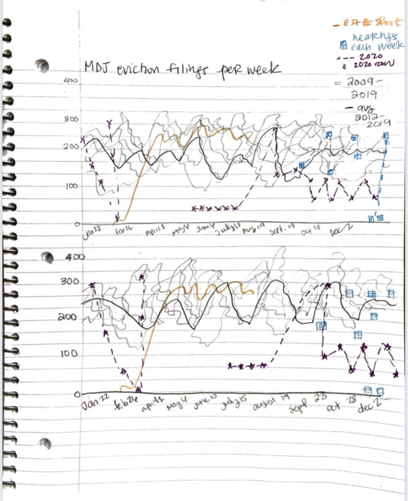

# Original data visualization

The [original visualization](http://evict-response.earthtime.org/) is by Anne Wright, a Carnegie Mellon University researcher. The chart appears to be part of CMU Create Lab’s eviction response initiative. However, it is likely the visual was made for a separate presentation aimed at a population with advanced education. Overall, it is an informative chart for individuals with housing and evictions industry knowledge. I chose to redesign it to be more accessible to the general public. 

# First redesigns 

As a part of my redesign process, I began by evaluating the chart’s effectiveness according to Stephen Few’s “Data Visualization Effectiveness Profile”. The major issues were with perceptibility because the abbreviations used are difficult for the uninitiated to understand. Additionally, the many colors and redundant use of lines dampen the beauty of the chart. These problems prompted me to reduce the use of the same type of representations (i.e., solid lines with Xs for the data points). The first redesigns changed the “hearings each week” variable from the solid green line in the original to a blue dashed line with boxes for data points. I also tried removing the dashed line altogether to create some distinction between the representation of variables. 

# First User Research Feedback 
I asked a graduate student in her early twenties to explain what was happening in my first redesign. She said she understood the sketch was showing how variables were changing over time but did not understand what some of the variables were, especially the “est number short variable”. Furthermore, she mentioned that the trends (increases and decreases) were easy to interpret and that it was clear the chart was about the count of evictions. After asking her about the intended audience, she said this chart could be helpful for a court clerk. 

I also spoke to a pair of graduate students in their twenties, and they had similar comments about the chart: “ what does MDJ and “est number short variable mean?” They also suggested moving the legend closer to the chart. All user research subjects at this point appreciated the use of gray on past years' data. 

# Second redesigns

# Second User Research Feedback 
My second redesigns were guided by the feedback from the first redesign, I added a more informative title and variable names to assist with intuitiveness. Furthermore, I noticed that my use of dashed lines did not help the students better understand the various variables being displayed. Therefore, I tested a version with combo charts (lines and bar graphs) and without the data from individual 2009 to 2019 data but kept the average from 2012 to 2019. The motivation behind these choices was to reduce the redundancies and highlight the 2020 year; thereby improving the usefulness of the chart. Additionally, for comparison purposes, I created a line chart version with the same streamlined data. My thinking was that perhaps the streamlined data would make use of a line chart more sensible. 

I showed both charts to another pair of graduate students and they liked the chart with only lines because it appeared “cleaner” and they were unsure why one set of variables was represented as bars and the other as lines. 

Finally, I asked one more graduate student her thoughts on the two graphs. She mentioned that it would be more effective to show the “shortfall” variable as a line and the rest as bars since the “shortfall” is an analysis and the other variables are raw data.

# Final redesign

The final redesign incorporated the feedback from the last graduate student. Additionally, I removed the “hearing every week variable” to assist the usefulness of the chart by removing information that was not essential to the main point of the chart: the effect of the eviction moratoriums on evictions in 2020. 

