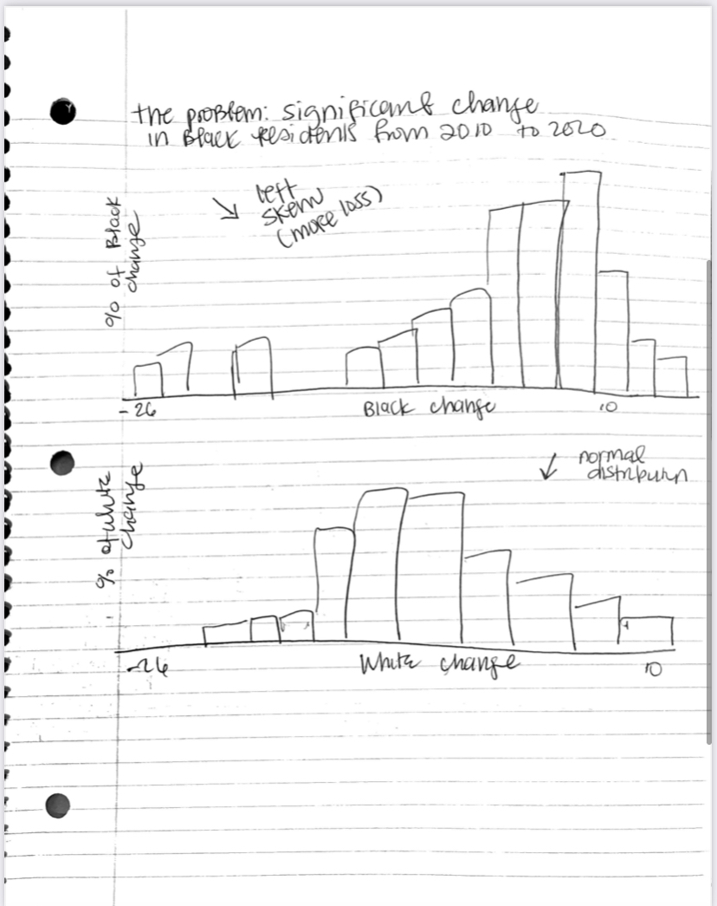

# Project Overview 

The City of Pittsburgh has seen a 10% decrease in its Black or African American population in the past decade. The Black exodus the city is experiencing is in line with a report that found Pittsburgh to be one of the worst cities (of its size) for Black employment. This project will explore the role housing, economic fragility, and violent crimes play in the issue. The housing data I am interested in showing are signs of gentrification and evictions by majority Black Pittsburgh neighborhoods. As for economic fragility, I plan on showing occupational segregation, poverty rates, lending patterns by race, and majority Black Pittsburgh neighborhoods. Lastly, the data on violent crimes will depict racial disparities in the city’s homicide rates. I chose these indicators because they are common push or pull factors in outmigration studies. In the end, I will consider this project successful if it can help members of the general public state three reasons why Black residents could be leaving Pittsburgh at an alarming rate. 

# Project Structure 
1. Background: Pittsburgh demographic data, a list of the minority majority or Black neighborhoods, and poverty status by race and ethnicity 
2. The problem: 10% Decrease in Pittsburgh's Black population between 2010 and 2020
3. The contributing factors 
    * Housing
            * Analysis of gentrification patterns in Pittsburgh Black or majority minority neighborhoods 
            * Comparing and contrasting housing loans given to majority minority neighborhoods and predominantly white neighborhoods
    * Economic fragility 
            * Occupation segregation - examining if Black residents concentrated in low paying jobs
            * Black unemployment rates from 2010 to 2020
     * Violent crimes - a breakdown of homicides and/or violent crimes by neighborhood demographics  
4. Where do we go from here?
    * policy reforms 
    * more investment in Black neighborhoods 
    * increase affordable housing 
# Story Arc

# User Stories 
Students: As a college or graduate student, I want data analysis on Black population change in Pittsburgh for research and academic projects. 

Non-profits : As the leader of a non-profit organization, I want data analysis on Black population change in Pittsburgh to establish a need or sense of urgency for the types of services my organization provides. 

Local Media:: As a journalist at a local media company I want data analysis on Black population change in Pittsburgh to support my articles on community issues 

# Data Sources 

2010 and 2020 Pittsburgh Decennial Census data** This main dataset I’ll be using for the project and it includes variables on Black population change, violent crimes per capita, total unemployment, Black unemployment, median household income, gini index, median house value, median gross rent, and Black income below the poverty level in 2010 and 2020 for 67 Pittsburgh neighborhoods (not all 90 Pittsburgh neighborhoods were included because of missing data). I plan on using this data to conduct and show exploratory data analysis (EDA) to establish the context for the following sections of the project. This will likely include which neighborhoods have experienced the highest change (loss) in Black residents, average Black employment per neighborhood, changes in rent values during the period. Additionally, I will highlight how these neighborhoods rank on variables associated with economic fragility, housing, crime. For example, if the exploratory data analysis I show indicates that the Point Breeze North neighborhood had the highest change in Black residents from 2010 to 2020, I would visually compare that finiding to Black unemployment in that neighborhood. 

The Pittsburgh Neighborhood Project’s Disadvantage Map data contains variables on percent Black and white, percent without internet access, single mother rate and disadvantage status for Pittsburgh neighborhoods. I plan on using this dataset to show that majority Black neighborhoods are often highly disadvantaged as determined by family poverty levels, shots fired, percent without access to a vehicle. The findings from these data will build on the insights from the main dataset. 

The Pittsburgh Neighborhood Project’s Level of Need data contains information which Pittsburgh neighborhoods are in need of investment as determined by socioeconomic status, college student enrollment, average homicide rates, and other factors. As with the disadvantage dataset I will use the information to examine where majority  Black neighborhoods rank and make connections between level of need and Black exodus in Pittsburgh.

# Sketches 

# Method and medium 
I plan to present my findings in Shorthand and Github. The Github page will be my formal findings in a report format. The Shorthand page will be a stylized display of my findings, which will include headers, descriptions, photos, charts and maps. 

