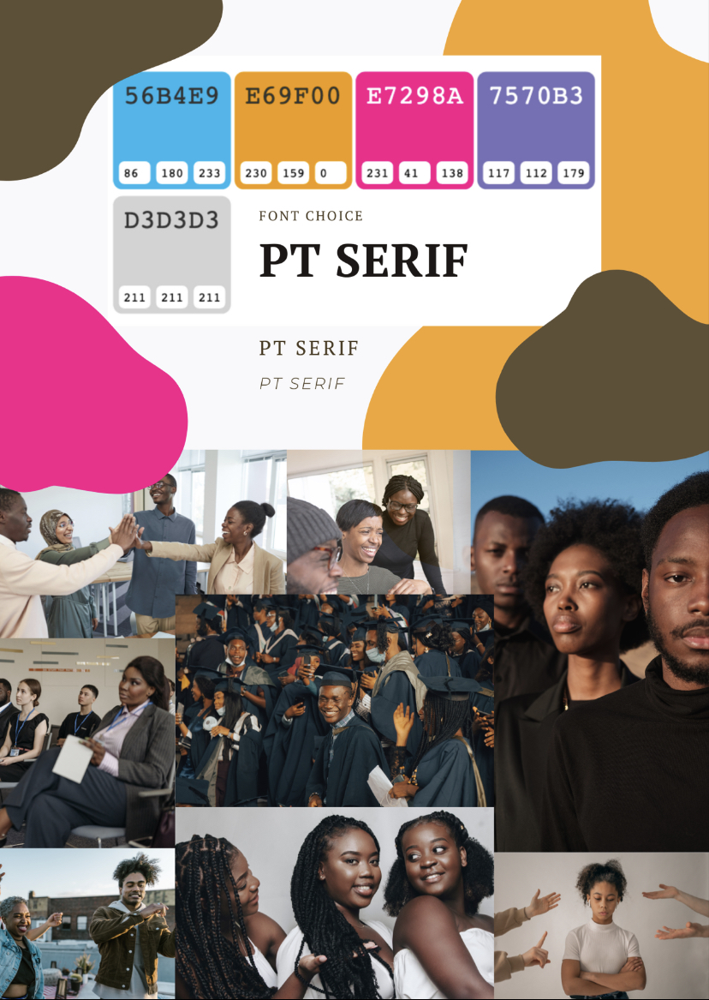
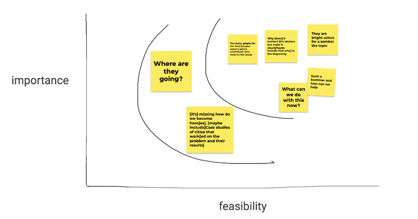

# Wireframes 
[Black Population Decline in Pittsburgh (on Shorthand)](https://preview.shorthand.com/nio5qGkw7Ke63hXs)

# Moodboard 

# User Research Protocol 
## Target Audience and Outreach Strategy

In [part 1](https://kisibor.github.io/portfolio/finalprojectpartone.html), I identified three user stories (students, nonprofits, local media). For the class presentation, I have decided to make students my target audience. As a result, interviewees had to be college or graduate students. Therefore,  when selecting participants to interview, I restricted my search to classmates and friends enrolled in higher education. 

## Interview Script: 
| Question                                                                                    | Goal (I asked the question to…)                                                  | Interviewee 1  Female, 20s-30s                                                                                                                                      | Interviewee 2 Female, 20s-30s                                                                                                        | Interviewee 3 Female, 20s-30s                                                                                |
|---------------------------------------------------------------------------------------------|----------------------------------------------------------------------------------|---------------------------------------------------------------------------------------------------------------------------------------------------------------------|--------------------------------------------------------------------------------------------------------------------------------------|--------------------------------------------------------------------------------------------------------------|
| What stood out to you in this presentation?                                                 | Understand the salient aspect of the presentation from the audience perspective  | The disparities in poverty chart                                                                                                                                    | All the different visuals talking about causes and seeing how widespread the issues is                                               | It’s clear that things are interconnected [and there’s a] clear story regardless  of variable                |
| Can you name one potential cause of Black exodus in Pittsburgh — why did you remember this  | Examine if the presentation is edifying and not just aesthetically pleasing      | Black males [are more represented] in violent crimes. [I remember because it was] “Shocking”                                                                        | Yes, violent crime because it lasts one                                                                                              | Housing prices [ stood out to me because of] my own interest                                                 |
| Any thoughts on the chart colors and background images?                                     | Get feedback on the color and image choices - are sensible or distracting?       | I Like the colors.  Blue and yellow are  color blind safe                                                                                                           | Colors [ were fine]  [consider] blowing  up the visuals [and] Make  them different [sizes]                                           | **They are bright colors for a somber the topic**                                                            |
| Could you interpret the charts at first glances                                             | Evaluate if the charts are can be easily comprehended and                        | I struggled the least  with the disparities in poverty chart  The neighborhoods in the median income [were less clear at first] But the bench mark clarified [it]   | Housing prices chart Stacked bar [was hard to interpret]  [maybe]  just color black and white and the rest gray [the other races]    | Housing prices – not sure what  colors are [ and not] clear [on the] sizes.   Not sure what i was comparing  |
| What worked?                                                                                | Which aspects of the presentation should I keep?                                 | The build up  [in] general and then indicators [specifying the causes]                                                                                              | Really, the variety of chart types                                                                                                   | The headings.  The order. The narrative layout.                                                              |
| What did not work?                                                                          | Which aspects of the presentation should I consider abandoning?                  | [It’s] missing how do we become hero[es]. [maybe include] Case studies of cities that work[ed on the problem and their results]                                     | **A Lot of words. [consider] Bold[ing]  important and bigger sizes**                                                                 | **Why [does] it matter? [It’s obvious but make it clear][Maybe include that why] in the beginning**          |
| What questions came up?                                                                     | What  should I look into or highlight?                                           | **What can we do with this now?**                                                                                                                                   |                                                                                                                                      |                                                                                                              |
| What new inspiration arose:?                                                                | Which aspects of the presentation should I lean into?                            |                                                                                                                                                                     | **Such a bummer and how can we help**                                                                                                | **Where are they going?**                                                                                    |
| Other comments                                                                              |                                                                                  |                                                                                                                                                                     | **Too many graphs for the final [maybe select ] which contributes [the most to the issue]**                                          | Colors for white  and black [and keep it consistent throughout]                                              |

# Key Findings 
- Too many charts and too many words
  * Interviews familiar with class felt that I would not have enough time to present all chart 
- Colors did not match the subject matter 
  * “[the color choices] are bright for a somber topic”
- No call to action
  * Interviews want to know what they could do to address the issue? 

# Prioritization Graph 

# Next steps: Updates to the Presentation
1. Change the colors to more muted colors
2. Streamline the text and use a large font. 
3. Select only 3 or 4 charts to display 
4. End with a clear call to action
